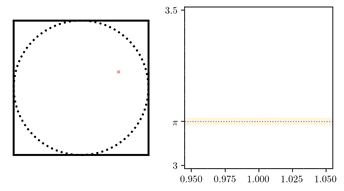

## QMCMC

Code, notes, and resources for the Fall '23 Quantum Monte Carlo and Las Vegas algorithms project at [MEGL](https://megl.science.gmu.edu/fall-2023/). Supervised by [Dr. Michael Jarret](https://science.gmu.edu/directory/michael-jarret), mentored by [Anthony Pizzimenti](https://mason.gmu.edu/~apizzime/). 

 

